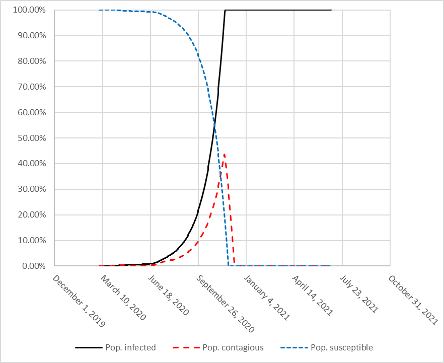
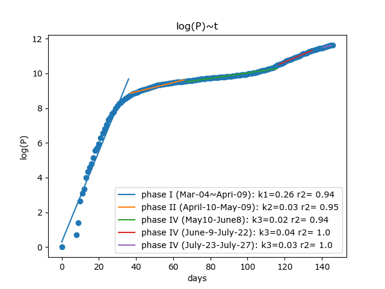

# COVID-Miami-Dade

The updated daily prediction based on new infection data in Miami-Dade county. (This Figure was produced on July 29)
## Table of Contents
1. [Description](#description)
2. [Authors](#authors)
3. [License](#license)
4. [Acknowledgement](#acknowledgement)

## Description
The WQEL research group developed a model to project COVID-19 cases in the Miami County going forward, based on State data for Miami-Dade County posted at Rebecca Jones’ site (https://floridacovidaction.com/). The model is partly based on the new July 6 finding by Pollán et al. (2020) that 90% of individuals in Spain with positive PCR more than 14 days before the study visit were seropositive for IgG antibodies. Hence we assume that, once an individual is infected, these antibodies will be protective through the Fall 2020.

Based on the County data posted online, the rate of increase in cases was 0.26 from Mar 4-April 9, 2020, then went down to 0.03 from April 10-May 9, 2020 due to lockdown, then down further to 0.01 from May 10-June 8, 2020 then up to 0.04 as Phase I kicked in from June 9-July 23. The past week (July 24-July 28, 2020) has witnessed a drop in the rate of increase down to 0.028. This rate of increase in cases was used for projection into the future. If this value continues, we assess that the cumulative percent of the County population infected begins to increase rapidly in October, hitting 100% of the population who has not self-isolated, in late Nov, 2020. Thereafter there is essentially no increase in infections, due to the fact that the seronegative, or susceptible, population has been reduced to include only the self-isolated population by November 28, 2020.

Figure 2 R-values under six phases

These results show the impact of controlling opportunities for transmission of the virus, in the short term until a vaccine becomes available.

This page was updated on July 29, 2020.

References

Pollán, Marina, et al. “Prevalence of SARS-CoV-2 in Spain (ENE-COVID): a nationwide, population-based seroepidemiological study.” The Lancet (2020).

Viceconte, Giulio, and Nicola Petrosillo. “COVID-19 R0: Magic number or conundrum?.” Infectious disease reports 12.1 (2020).

Liu, Ying, et al. “The reproductive number of COVID-19 is higher compared to SARS coronavirus.” Journal of travel medicine (2020).

## Downloading

## Authors
* [Water Quality Lab](https://coemiamiedu.wordpress.com/miami-dade-covid-19-risk-assessment/)
* [Chao Ji](https://github.com/jichaojoyce)

## License
Feel free to share with your loves! Wear masks and stay health!

## Acknowledgements

This research is voluntary and lead by Dr. Englehardt, because of the concerns about the Miami epidemic.
